<h1 align="center">📝 Blogging Page</h1>
<p align="center">A responsive and dynamic blog management system built with <b>PHP, MySQL, HTML, CSS, JS</b> – hosted on <b>XAMPP</b></p>


---

## 🚀 Overview

This project is a simple yet powerful **blogging platform** designed using **core PHP** and **MySQL**. It allows an admin to manage blog posts, categories, and users with role-based access. The frontend is clean and responsive, powered by **Bootstrap**, while the backend handles all the data processing using raw PHP and SQL.

---

## 🔥 Features

- ✅ View all blogs on homepage
- 🧑 Admin login and role-based access
- 📝 Add, Edit, Delete blog articles
- 🗂️ Manage blog categories
- 👥 Manage users and permissions
- 📬 Contact form (message stored in DB)
- 🌙 Global Dark Mode toggle
- 🧾 Toast notifications for feedback
- 📱 Responsive UI using Bootstrap

---

## 🖼️ Screenshots

> Below are previews of different pages from the blogging platform. 


 **Home Page**      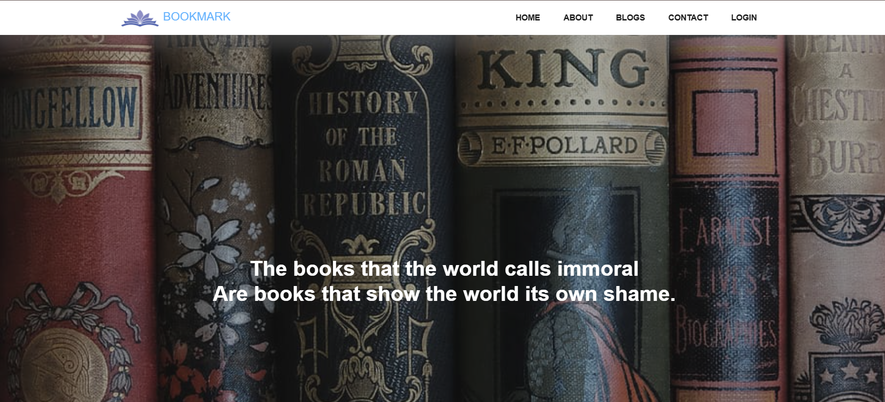 
 **All Blogs**      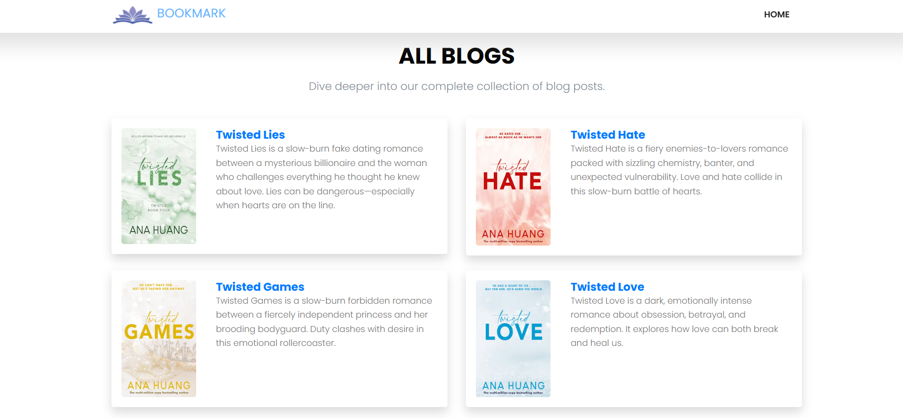 
 **Single Blog**     
 **Add Article**    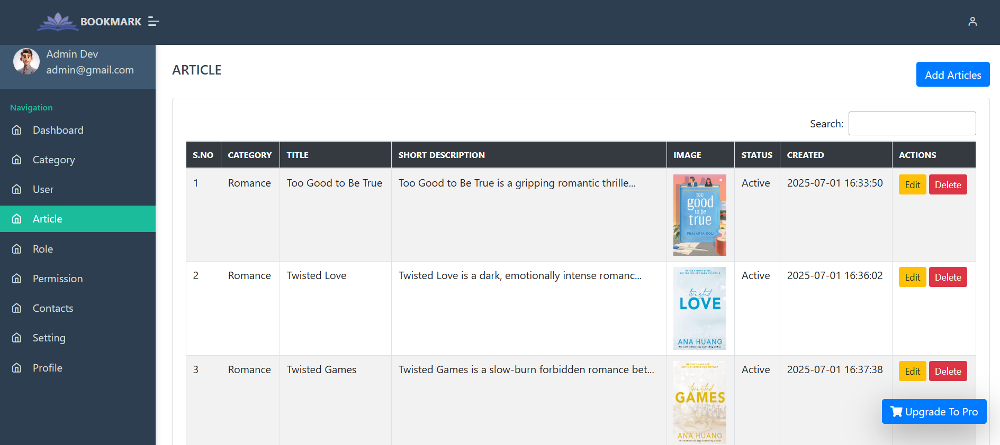 
 **About Page**     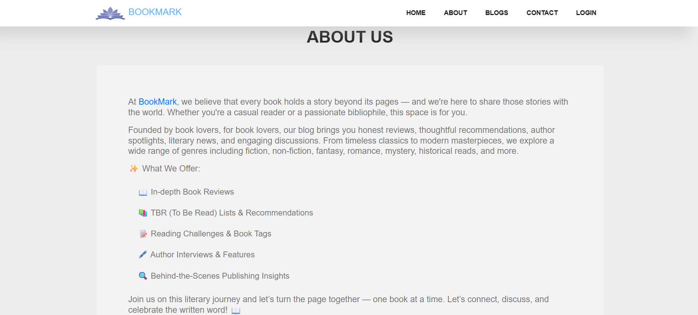 
 **Login Page**     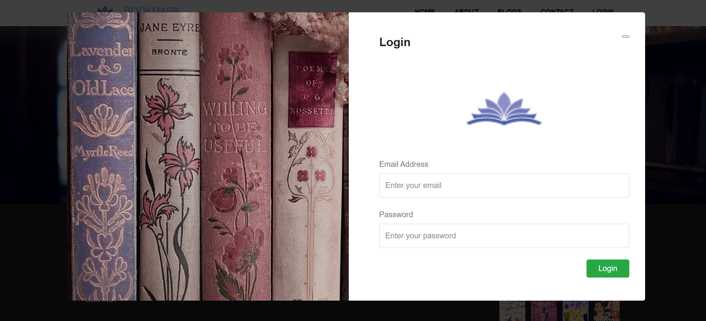 
 **Contact Page**   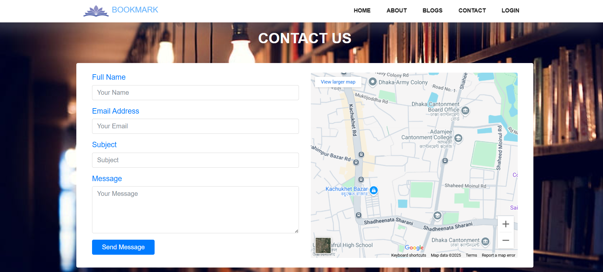 
 **Contact Table**  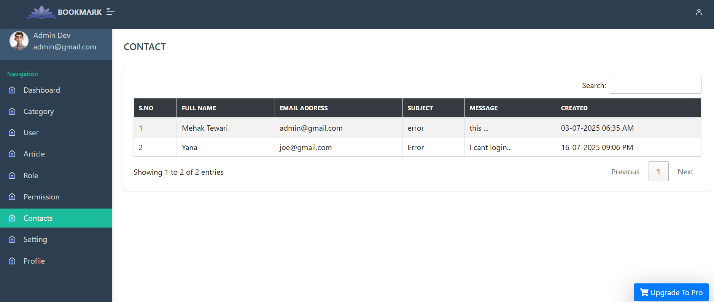 
 **Comment Table**  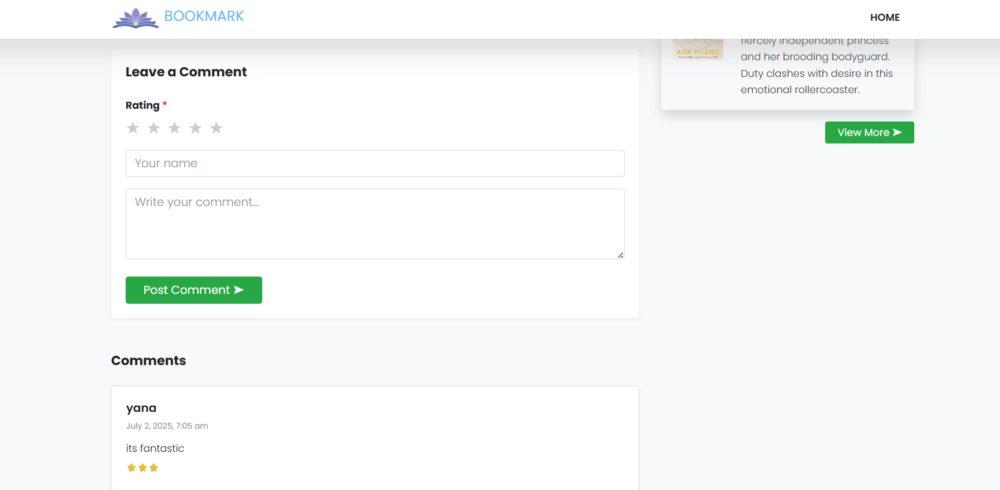 
 **Admin Dashboard**   
 **Category Page**  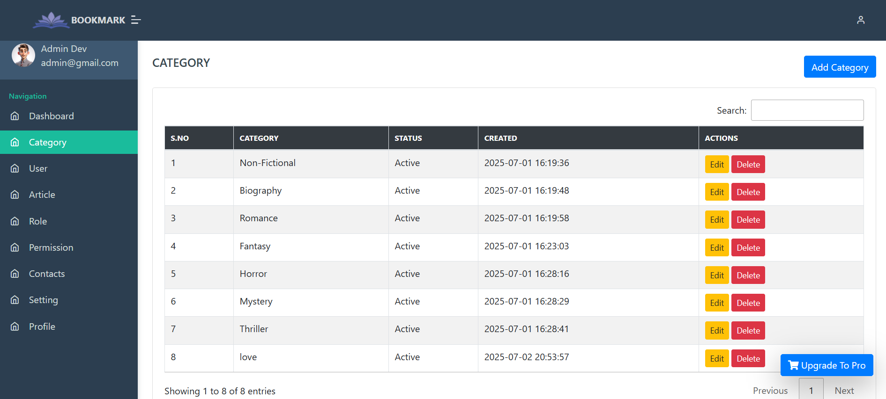 
 **User Roles**     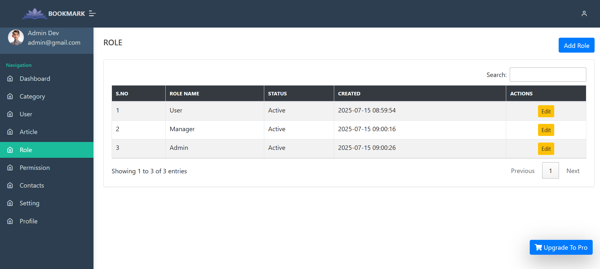 
 **Permissions**    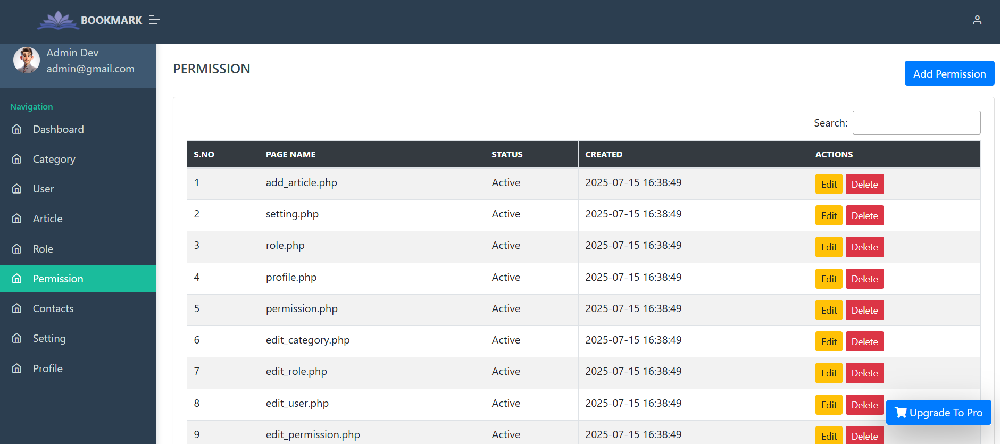 
 **Users Page**     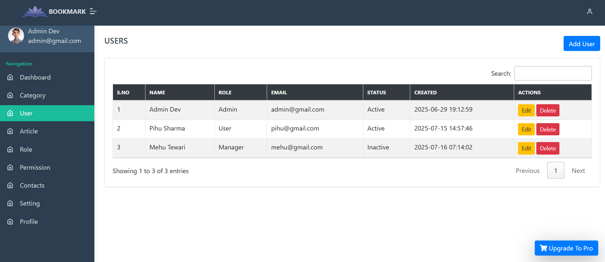 
 **Profile Page**   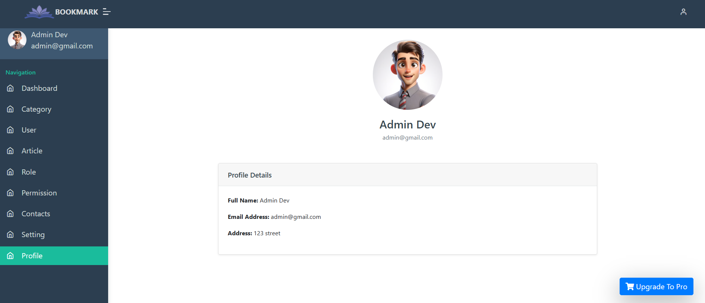 
 **Settings Page**  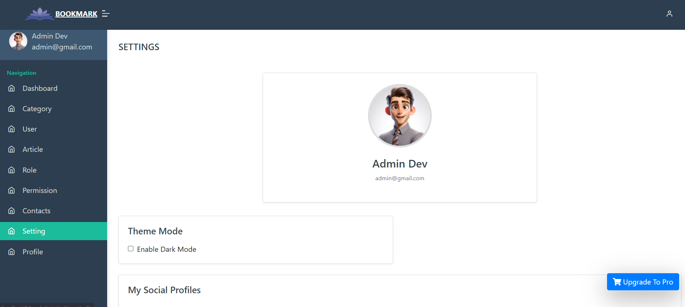 
---

## 🛠️ Tech Stack

| Stack       | Tools Used                  |
|-------------|-----------------------------|
| **Frontend**| HTML, CSS, Bootstrap        |
| **Backend** | PHP                         |
| **Database**| MySQL                       |
| **Server**  | XAMPP (Apache + MySQL)      |
| **Other**   | JavaScript, Toasts, Sessions|

---

## 📦 Installation Guide (XAMPP)

Follow these steps to run this project on your local machine:

1. **Clone the Repository**
   ```bash
   git clone https://github.com/mehaktewari/Blogging-Page.git
   ```

2. **Move to XAMPP Directory**
   - Copy the project folder to: `C:/xampp/htdocs/Blogging-Page`

3. **Start Apache & MySQL**
   - Open XAMPP Control Panel
   - Start **Apache** and **MySQL**

4. **Create Database**
   - Visit: `http://localhost/phpmyadmin`
   - Create DB: `blog_db` *(or any name)*
   - Import the provided `database.sql` file

5. **Update DB Config**
   - Open `includes/connection.php` and set:
     ```php
     $conn = mysqli_connect("localhost", "root", "", "blog_db");
     ```

6. **Visit in Browser**
   ```
   http://localhost/Blogging-Page/
   ```

---

## 📁 Project Structure

```
📦 Blogging-Page/
├── 🧠 admin/              # Admin panel (blog, user, category mgmt)
├── 📄 includes/           # DB connection, sessions, helper files
├── 🖼️ assets/             # CSS, JS, Images
├── 🖼️ public/screenshots/ # Screenshots for README
├── 📃 index.php           # Homepage (All Blogs)
├── 📬 contact.php         # Contact page
├── 🔐 login.php           # User/Admin login
├── 📂 database.sql        # MySQL DB structure
└── ...
```

---

## 👩‍💻 Author

> Crafted with ❤️ by [**Mehak Tewari**](https://github.com/mehaktewari)

📧 Email: mehaktewari@gmail.com  
🔗 [LinkedIn](https://www.linkedin.com/in/mehak-tewari-04934b247/)

---

## 📄 License

This project is licensed under the [MIT License](LICENSE).
